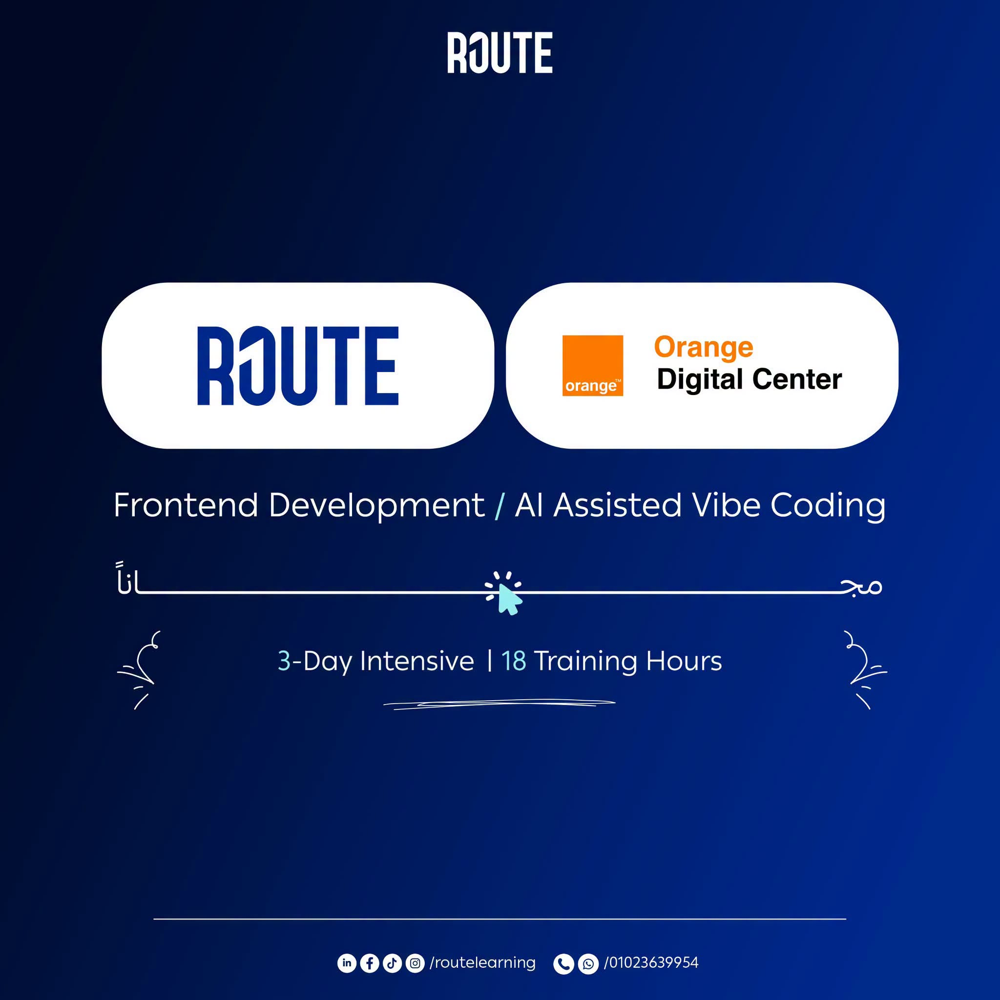

# FreshCart - Modern E-Commerce Platform



[](https://developer.mozilla.org/en-US/docs/Web/HTML)
[](https://developer.mozilla.org/en-US/docs/Web/JavaScript)
[](https://getbootstrap.com/)
[](https://fontawesome.com/)
[](https://ecommerce.routemisr.com/)

FreshCart is a production-grade, responsive e-commerce web application engineered with clean architectural principles, reactive state management, WCAG 2.1 AA accessibility, and seamless integration with the Route E-Commerce REST API.

---

## Table of Contents

- [Overview](#overview)
- [Key Features](#key-features)
- [Architectural Highlights](#architectural-highlights)
- [Application Pages](#application-pages)
- [Project Structure](#project-structure)
- [Getting Started](#getting-started)
- [API Integration](#api-integration)
- [Security & Performance](#security--performance)

---

## Overview

FreshCart delivers an authentic, end-to-end shopping journey. Users can discover trending groceries, electronics, and fashion items, apply multi-faceted filtering, manage their persistent cart and wishlist across browser tabs, and authenticate via secure REST endpoints.

---

## Key Features

- **Dynamic Catalog Discovery**: Real-time keyword search with client-side debouncing and API-backed category filtering.
- **Multi-Faceted Shop Filtering**: Filter by category, brand, price, rating, or sort dynamically (Price: Low to High, High to Low, Highest Rated, Title).
- **Interactive Product Details**: Multi-image thumbnail gallery, bounded quantity steppers, live price recalculation, and instant "Buy Now" checkout.
- **High-Performance Shopping Cart**:
  - In-place targeted DOM mutations on quantity step (eliminates layout thrashing).
  - Integer-scaled currency calculations preventing IEEE 754 binary floating-point drift.
  - Zero mock data injection: an empty cart stays empty.
- **Persistent Wishlist**: Save favorite products with instant cross-tab synchronization and one-click "Move to Cart" actions.
- **Authentication Suite**:
  - Secure login & registration with client-side validation (email regex, password requirements, phone verification).
  - JWT token and user session persistence.
  - Dynamic navbar synchronization: automatically displays "Hello, {User}" and sign-out controls when authenticated.

---

## Architectural Highlights

```
                          FreshCart Core Architecture
┌─────────────────────────────────────────────────────────────────────────────┐
│                             Browser Views                                   │
│  index.html  │  Shop.html  │  Categories.html  │  Cart.html  │ Wishlist.html│
└──────────────────────────────────────┬──────────────────────────────────────┘
                                       │
                                       ▼
┌─────────────────────────────────────────────────────────────────────────────┐
│                   Centralized State Domain (utilities.js)                   │
│  • Storage Engine (Quota Protection)   • Normalized Cart & Wishlist Schema  │
│  • Scaled Integer Math (formatCurrency)• Cross-Tab Sync (window.onstorage)  │
│  • HTML Entity Escaping (escapeHtml)   • Auth & Session Token Persistence   │
└───────────────────────┬─────────────────────────────────────┬───────────────┘
                        │                                     │
                        ▼                                     ▼
        ┌───────────────────────────────┐     ┌───────────────────────────────┐
        │        Local Storage          │     │     Route E-Commerce API      │
        │  freshcart_cart               │     │  /api/v1/products             │
        │  freshcart_wishlist           │     │  /api/v1/categories           │
        │  freshcart_token              │     │  /api/v1/brands               │
        │  freshcart_user               │     │  /api/v1/auth/signin | signup │
        └───────────────────────────────┘     └───────────────────────────────┘
```

1. **Single Source of Truth (`FreshCart` Domain)**: All localStorage interactions, cart mutations, wishlist queries, and session management reside in `JS/utilities.js`.
2. **Defensive Async Operations**: In-flight requests use `AbortController` cancellation to eliminate race conditions from out-of-order responses during rapid searching or filtering.
3. **Strict Content Security Policy (CSP)**: Zero inline `onclick` or `onerror` handlers; all interactions rely on high-performance event delegation with `data-action` attributes.
4. **XSS Immunity**: Dynamic API inputs are strictly sanitized via contextual HTML entity escaping (`FreshCart.escapeHtml`) and protocol validation (`FreshCart.sanitizeUrl`).

---

## Application Pages

| Page | Path | Description |
|---|---|---|
| **Home** | `index.html` | Hero carousel, featured departments, trending deals, and product grid. |
| **Shop** | `Pages/Shop.html` | Full product catalog with sidebar filters (category, brand), sort select, and pagination. |
| **Categories** | `Pages/Categories.html` | Department directory loaded dynamically from `/api/v1/categories`. |
| **Brands** | `Pages/Brands.html` | Verified partner brands directory loaded from `/api/v1/brands`. |
| **Wishlist** | `Pages/Wishlist.html` | Saved items table with stock status, move-to-cart, and remove actions. |
| **Cart** | `Pages/Cart.html` | Itemized order review with stepper controls, live subtotals, and checkout CTA. |
| **Product Details** | `Pages/ProductDetails.html` | Product gallery, specifications, customer reviews, and quantity stepper. |
| **Sign In** | `Pages/Login.html` | User authentication form with Route API session persistence. |
| **Sign Up** | `Pages/Signup.html` | New customer registration with validation checklist. |

---

## Project Structure

```
d:\VS Projects\ODC\
├── index.html                   # Homepage entry point
├── freshcart-logo.svg           # Brand logo asset
├── style.css                    # Unified design system & responsive styling
├── README.md                    # Project documentation
├── Readme/
│   └── bg.jpg                   # Hero banner asset
├── JS/                          # Application logic & domain modules
│   ├── auth.js                  # Authentication & session service
│   ├── brands.js                # Brands directory engine
│   ├── cart.js                  # Cart experience & stepper engine
│   ├── categories.js            # Category showcase engine
│   ├── Main.js                  # Homepage discovery & catalog engine
│   ├── product-details.js       # Product gallery & interactive stepper
│   ├── shop.js                  # Multi-faceted filter & catalog engine
│   ├── utilities.js             # Centralized FreshCart state domain
│   └── wishlist.js              # Saved wishlist engine
└── Pages/                       # Canonical application subpages
    ├── Brands.html
    ├── Cart.html
    ├── Categories.html
    ├── Login.html
    ├── ProductDetails.html
    ├── Shop.html
    ├── Signup.html
    └── Wishlist.html
```

---

## Getting Started

### Prerequisites
- Any modern web browser (Chrome, Edge, Firefox, Safari).
- Node.js (optional, for local development server and running tests).

### Local Installation & Preview

1. **Clone the repository:**
   ```bash
   git clone https://github.com/Steven-Amin02/Orange-Route-Ecommerce.git
   cd Orange-Route-Ecommerce
   ```

2. **Install dependencies (Bootstrap & Icons):**
   ```bash
   npm install
   ```

3. **Run locally using any HTTP server:**
   - **Using VS Code Live Server extension**: Right click `index.html` and select **Open with Live Server**.
   - **Using `npx serve`**:
     ```bash
     npx serve .
     ```
   - Then open `http://localhost:3000` (or `http://localhost:5500`) in your browser.

---

## API Integration

FreshCart integrates with the public Route Academy E-Commerce REST API:
- **Base URL**: `https://ecommerce.routemisr.com/api/v1`
- **Endpoints**:
  - `GET /products` - Catalog listings with pagination and category filtering
  - `GET /products/{id}` - Detailed product specifications
  - `GET /categories` - Department categories
  - `GET /brands` - Partner brands
  - `POST /auth/signin` - User login
  - `POST /auth/signup` - User registration

---

## Security & Performance

- **Sanitization**: Entity escaping on all dynamic template strings eliminates Stored XSS injection.
- **Precision**: Scaled integer calculations prevent binary floating-point rounding errors on currency displays.
- **Reactivity**: Native `window.addEventListener('storage')` propagates cart, wishlist, and session updates across tabs without background polling.
- **Accessibility**: Semantic HTML5 markup, ARIA labels (`aria-label`, `aria-live="polite"`), and full keyboard navigation meet WCAG 2.1 AA guidelines.
